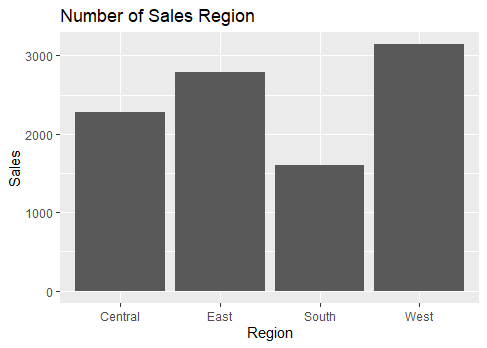
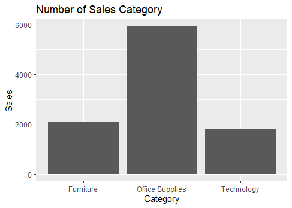

# R-Assignment 4

**Created by Tarathep Siripis (ID: 63130500055)**

## Dataset
Superstore Sales Dataset (Data from Rohit Sahoo,[Kaggle](https://www.kaggle.com/rohitsahoo/sales-forecasting)) >> [Using CSV](https://raw.githubusercontent.com/safesit23/INT214-Statistics/main/datasets/superstore_sales.csv)

### _Context_
>Retail dataset of a global superstore for 4 years.
Perform EDA and Predict the sales of the next 7 days from the last date of the Training dataset!

### _Content_
>Time series analysis deals with time series based data to extract patterns for predictions and other characteristics of the data. It uses a model for forecasting future values in a small time frame based on previous observations. It is widely used for non-stationary data, such as economic data, weather data, stock prices, and retail sales forecasting.

### _Dataset_
>The dataset is easy to understand and is self-explanatory

### _Inspiration_
>Perform EDA and Predict the sales of the next 7 days from the last date of the Training dataset!

### Outlines
* Explore the dataset
* Learning function from Tidyverse
* Transform data with dplyr and finding insight the data
* Visualization with GGplot2

## Part 1: Explore the dataset
### Step 1: เรียกใช้ Library และ Import Dataset
```R
# Library
library(dplyr)
library(readr)
library(stringr)
library(tidyr)
library(assertive)
library(ggplot2)
library(DescTools)

# Dataset
superstore_sales <- read_csv("https://raw.githubusercontent.com/safesit23/INT214-Statistics/main/datasets/superstore_sales.csv");
```
### Step 2: ดูข้อมูลใน dataset
```R
#ViewDataset
glimpse(superstore_sales)
```
Result:
```
Rows: 9,800
Columns: 18
$ `Row ID`        <dbl> 1, 2, 3, 4, 5, 6, 7, 8, 9, 10, 11, 12, 13, 14, 15, 16, 17, 18, 19, 20, 21, 22, 23, 24, 25, 26, ~
$ `Order ID`      <chr> "CA-2017-152156", "CA-2017-152156", "CA-2017-138688", "US-2016-108966", "US-2016-108966", "CA-2~
$ `Order Date`    <chr> "08/11/2017", "08/11/2017", "12/06/2017", "11/10/2016", "11/10/2016", "09/06/2015", "09/06/2015~
$ `Ship Date`     <chr> "11/11/2017", "11/11/2017", "16/06/2017", "18/10/2016", "18/10/2016", "14/06/2015", "14/06/2015~
$ `Ship Mode`     <chr> "Second Class", "Second Class", "Second Class", "Standard Class", "Standard Class", "Standard C~
$ `Customer ID`   <chr> "CG-12520", "CG-12520", "DV-13045", "SO-20335", "SO-20335", "BH-11710", "BH-11710", "BH-11710",~
$ `Customer Name` <chr> "Claire Gute", "Claire Gute", "Darrin Van Huff", "Sean O'Donnell", "Sean O'Donnell", "Brosina H~
$ Segment         <chr> "Consumer", "Consumer", "Corporate", "Consumer", "Consumer", "Consumer", "Consumer", "Consumer"~
$ Country         <chr> "United States", "United States", "United States", "United States", "United States", "United St~
$ City            <chr> "Henderson", "Henderson", "Los Angeles", "Fort Lauderdale", "Fort Lauderdale", "Los Angeles", "~
$ State           <chr> "Kentucky", "Kentucky", "California", "Florida", "Florida", "California", "California", "Califo~
$ `Postal Code`   <dbl> 42420, 42420, 90036, 33311, 33311, 90032, 90032, 90032, 90032, 90032, 90032, 90032, 28027, 9810~
$ Region          <chr> "South", "South", "West", "South", "South", "West", "West", "West", "West", "West", "West", "We~
$ `Product ID`    <chr> "FUR-BO-10001798", "FUR-CH-10000454", "OFF-LA-10000240", "FUR-TA-10000577", "OFF-ST-10000760", ~
$ Category        <chr> "Furniture", "Furniture", "Office Supplies", "Furniture", "Office Supplies", "Furniture", "Offi~
$ `Sub-Category`  <chr> "Bookcases", "Chairs", "Labels", "Tables", "Storage", "Furnishings", "Art", "Phones", "Binders"~
$ `Product Name`  <chr> "Bush Somerset Collection Bookcase", "Hon Deluxe Fabric Upholstered Stacking Chairs, Rounded Ba~
$ Sales           <dbl> 261.9600, 731.9400, 14.6200, 957.5775, 22.3680, 48.8600, 7.2800, 907.1520, 18.5040, 114.9000, 1~
```
>จากผลลัพธ์ด้านบนจะเห็นได้ว่ามีข้อมูลทั้งหมด 9800 ข้อมูล และตัวแปรทั้งหมด 18 ตัว แต่ละตัวแปรมีประเภทและความหมาย ดังนี้

| _No._ | _Columns_        | _Type_     | _Explanation_  |
|:-|:-|:-|:-|
|  1  | Row ID         | numeric  | ลำดับของข้อมูล |
|  2  | Order ID       | character| ID ของออเดอร์ |
|  3  | Order Date     | character| วันที่สั่งสินค้า |
|  4  | Ship Date      | character| วันที่จัดส่ง |
|  5  | Ship mode      | character| รูปแบบการจัดส่ง |
|  6  | Customer ID    | character| ID ของลูกค้า |
|  7  | Customer Name  | character| ชื่อของลูกค้า |
|  8  | Segment        | character| ประเภทของลูกค้า |
|  9  | Country        | character| ประเทศที่ลูกค้าต้องการจัดส่ง |
|  10  | City          | character| เมืองที่ลูกค้าต้องการจัดส่ง |
|  11  | State         | character| รัฐที่ลูกค้าต้องการจัดส่ง  |
|  12  | Postal Code   | numeric  | รหัสไปรษณีย์ที่ลูกค้าต้องการจัดส่ง |
|  13  | Region        | character| ภูมิภาคที่ลูกค้าต้องการจัดส่ง |
|  14  | Product ID    | character| ID ของสินค้า |
|  15  | Category      | character| หมวดหมู่ของสินค้า |
|  16  | Sub Category  | character| หมวดหมู่ย่อยของสินค้า |
|  17  | Product Name  | character| ชื่อสินค้า |
|  18  | Sales         | numeric  | ราคาของสินค้า |

## Part 2: Learning function from Tidyverse
- Function select() from package dplyr. It using for select columns
```R
superstore_sales %>% select(`Customer ID`,`Customer Name`,City) %>% filter(City == "New York City")
```

## Part 3: Transform data with dplyr and finding insight the data

### 1. ปีที่มีการขายได้มากที่สุด
```R
superstore_sales$`Order Date` <- as.Date(as.character(superstore_sales$`Order Date`),"%d/%m/%Y")
class(superstore_sales$`Order Date`)
superstore_sales$Year <- format(superstore_sales$`Order Date`, "%Y") 

superstore_sales %>% select(Year) %>% count(Year) %>% slice_max(Year)
```
Result:
```
  Year      n
  <chr> <int>
1 2018   3258
```
#### Explain 
>ปี 2018 เป็นปีที่มีการขายมากที่สุด และขายได้มากถึง 3258 ออเดอร์

### 2. ลูกค้าที่มียอดซื้อมากที่สุด
```R
superstore_sales %>% select(`Customer Name` , Sales) %>% 
  group_by(`Customer Name`) %>% summarise(sumOfSales = sum(Sales)) %>% slice_max(sumOfSales)
```
Result:
```
  `Customer Name` sumOfSales
  <chr>                <dbl>
1 Sean Miller         25043.
```
#### Explain 
>Sean Miller มียอดซื้อถึง 25043 USD. และเป็นลูกค้าที่มียอดซื้อมากที่สุด

### 3. Top3 สินค้าที่ทำรายได้ได้มากที่สุด
```R
superstore_sales %>% select(`Product Name` , Sales) %>% 
  group_by(`Product Name`) %>% summarise(sumOfSales = sum(Sales)) %>% arrange(desc(sumOfSales)) %>% slice(1:3)
```
Result:
```
  `Product Name`                                                              sumOfSales
  <chr>                                                                            <dbl>
1 Canon imageCLASS 2200 Advanced Copier                                           61600.
2 Fellowes PB500 Electric Punch Plastic Comb Binding Machine with Manual Bind     27453.
3 Cisco TelePresence System EX90 Videoconferencing Unit                           22638.
```
#### Explain 
> 3 อันดับ ที่มีรายได้มากที่สุดคือ
> อันดับที่ 1 Canon imageCLASS 2200 Advanced Copier ทำรายได้ 61600 USD.
> อันดับที่ 2 Fellowes PB500 Electric Punch Plastic Comb Binding Machine with Manual Bind ทำรายได้ 27453 USD.
> อันดับที่ 3 Cisco TelePresence System EX90 Videoconferencing Unit ทำรายได้ 22638 USD.

### 4. สินค้าประเภทใดที่มีจำนวนการสั่งซื้อมากที่สุด
```R
superstore_sales %>% select(Category) %>% count(Category) %>% slice_max(Category)
```
Result:
```
  Category       n
  <chr>      <int>
1 Technology  1813
```
#### Explain 
> สินค้าประเภท Technology เป็นสินค้าที่การสั่งซื้อมากที่สด และมีการสั่งซื้อมากถึง 1813 ชิ้น

### 5. ประเภทการจัดส่งที่มีจำนวนการจัดส่งน้อยที่สุด และห่างจากประเภทการจัดส่งที่มีจำนวนการจัดส่งมากที่สุดอยู่เท่าไร
```R
minShipmode <- superstore_sales %>% select(`Ship Mode`) %>% count(`Ship Mode`) %>% slice_min(`Ship Mode`)
maxShipmode <- superstore_sales %>% select(`Ship Mode`) %>% count(`Ship Mode`) %>% slice_max(`Ship Mode`)
maxShipmode$n - minShipmode$n

```
Result:
```
> as_tibble(minShipmode)
# A tibble: 1 x 2
  `Ship Mode`     n
  <chr>       <int>
1 First Class  1501
```
```
> as_tibble(maxShipmode)
# A tibble: 1 x 2
  `Ship Mode`        n
  <chr>          <int>
1 Standard Class  5859
```
```
4358
```
#### Explain 
>ประเภทการจัดส่งที่มีจำนวนการจัดส่งน้อยที่สุดคือ First Class มีจำนวนการจัดส่งอยู่ที่ 1501 ห่างจากประเภทการจัดส่งที่มีจำนวนการจัดส่งมากที่สุด 4358 ครั้ง คือ Standard Class ที่จำนวนการจัดส่งอยู่ 5859 ครั้ง

### 6. Top3 เมืองที่มีการสั่งซื้อสินค้ามากที่สุด
```R
superstore_sales %>% select(City) %>% count(superstore_sales$City) %>% arrange(desc(n)) %>%  slice(1:3)
```
Result:
```
  `superstore_sales$City`     n
  <chr>                   <int>
1 New York City             891
2 Los Angeles               728
3 Philadelphia              532
```
#### Explain 
> อันดับ1 New York City จำนวนการสั่งสินค้า 891 ครั้ง อันดับที่2 Los Angeles มีจำนวนการสั่งสินค้า 728 ครั้ง อันดับที่3 Philadelphia มีจำนวนการจัดส่งสินค้า 532 ครั้ง

## Part 4: Visualization with GGplot2
### 1. Graph show relation between Ship Mode and Sales
```R
Region_plot <- ggplot(superstore_sales, aes(x= Region)) + geom_bar(); 

Region_plot + ggtitle("Number of Sales Region") +
  xlab("Region") + ylab("Sales")
```
Result:



### 2.) Graph show relation between Segment and Sales
```R
Category_plot <- ggplot(superstore_sales, aes(x= Category)) + geom_bar(); 

Category_plot + ggtitle("Number of Sales Category") +
  xlab("Category") + ylab("Sales")

```
Result:


