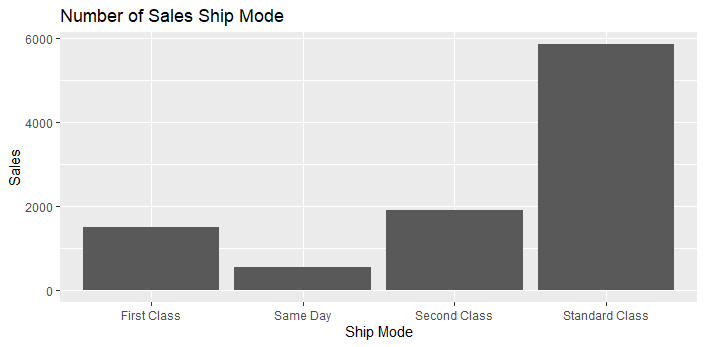
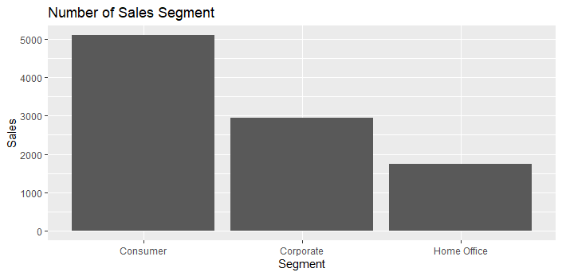

# R-Assignment 4

**Created by Thanyakorn Thalaengdi (ID: 63130500056)**

# Dataset:
Superstore Sales Dataset (Data from Rohit Sahoo,[Kaggle](https://www.kaggle.com/rohitsahoo/sales-forecasting)) >> [Using CSV](https://raw.githubusercontent.com/safesit23/INT214-Statistics/main/datasets/superstore_sales.csv)

### Context
>Retail dataset of a global superstore for 4 years.
Perform EDA and Predict the sales of the next 7 days from the last date of the Training dataset!

### Content
>Time series analysis deals with time series based data to extract patterns for predictions and other characteristics of the data. It uses a model for forecasting future values in a small time frame based on previous observations. It is widely used for non-stationary data, such as economic data, weather data, stock prices, and retail sales forecasting.

### Outlines
1. Explore the dataset
2. Learning function from Tidyverse
3. Transform data with dplyr and finding insight the data
4. Visualization with GGplot2

## Part 1: Explore the dataset

```R
# Library
library(dplyr)
library(readr)
library(stringr)
library(tidyr)
library(assertive)
library(ggplot2)
library(DescTools)

# Dataset
Superstore_Sales <- read_csv("https://raw.githubusercontent.com/safesit23/INT214-Statistics/main/datasets/superstore_sales.csv");

#ViewDataset
glimpse(Superstore_Sales)
```
Result:
```
Rows: 9,800
Columns: 18
$ `Row ID`        <dbl> 1, 2, 3, 4, 5, 6, 7, 8, 9, 10, 1~
$ `Order ID`      <chr> "CA-2017-152156", "CA-2017-15215~
$ `Order Date`    <chr> "08/11/2017", "08/11/2017", "12/~
$ `Ship Date`     <chr> "11/11/2017", "11/11/2017", "16/~
$ `Ship Mode`     <chr> "Second Class", "Second Class", ~
$ `Customer ID`   <chr> "CG-12520", "CG-12520", "DV-1304~
$ `Customer Name` <chr> "Claire Gute", "Claire Gute", "D~
$ Segment         <chr> "Consumer", "Consumer", "Corpora~
$ Country         <chr> "United States", "United States"~
$ City            <chr> "Henderson", "Henderson", "Los A~
$ State           <chr> "Kentucky", "Kentucky", "Califor~
$ `Postal Code`   <dbl> 42420, 42420, 90036, 33311, 3331~
$ Region          <chr> "South", "South", "West", "South~
$ `Product ID`    <chr> "FUR-BO-10001798", "FUR-CH-10000~
$ Category        <chr> "Furniture", "Furniture", "Offic~
$ `Sub-Category`  <chr> "Bookcases", "Chairs", "Labels",~
$ `Product Name`  <chr> "Bush Somerset Collection Bookca~
$ Sales           <dbl> 261.9600, 731.9400, 14.6200, 957~
```
>Superstore Sales Dataset มีจำนวนข้อมูลทั้งหมด 9800 ข้อมูลและมีตัวแปรทั้งหมด 18 ตัว แต่ละตัวแปรมีชนิดข้อมูลและความหมาย ดังนี้

| No. | Columns        | Type     | Explanation               |
|:---:|----------------|----------|---------------------------|
|  1  | Row ID         | numeric  | ลำดับของข้อมูล |
|  2  | Order ID       | character| ID ของออเดอร์ |
|  3  | Order Date     | character| วันที่สั่งสินค้า |
|  4  | Ship Date      | character| วันที่จัดส่ง |
|  5  | Ship mode      | character| รูปแบบการจัดส่ง |
|  6  | Customer ID    | character| ID ของลูกค้า |
|  7  | Customer Name  | character| ชื่อของลูกค้า |
|  8  | Segment        | character| ประเภทของลูกค้า |
|  9  | Country        | character| ประเทศที่ลูกค้าต้องการจัดส่ง |
|  10  | City          | character| เมืองที่ลูกค้าต้องการจัดส่ง |
|  11  | State         | character| รัฐที่ลูกค้าต้องการจัดส่ง  |
|  12  | Postal Code   | numeric  | รหัสไปรษณีย์ที่ลูกค้าต้องการจัดส่ง |
|  13  | Region        | character| ภูมิภาคที่ลูกค้าต้องการจัดส่ง |
|  14  | Product ID    | character| ID ของสินค้า |
|  15  | Category      | character| หมวดหมู่ของสินค้า |
|  16  | Sub Category  | character| หมวดหมู่ย่อยของสินค้า |
|  17  | Product Name  | character| ชื่อสินค้า |
|  18  | Sales         | numeric  | ราคาของสินค้า |


## Part 2: Learning function from Tidyverse
- Function slice_max() from package dplyr. It using for select rows with highest values of a variable.
```R
Superstore_Sales %>% select(`Product Name` , Sales) %>% 
  group_by(`Product Name`) %>% summarise(sumOfSales = sum(Sales)) %>% slice_max(sumOfSales)
```

##### Result:

```
  `Product Name`                        sumOfSales
  <chr>                                      <dbl>
1 Canon imageCLASS 2200 Advanced Copier     61600.
```

- Function slice_min() from package dplyr. It using for select rows with lowest values of a variable.
```R
  `Product Name`                                                   sumOfSales
  <chr>                                                                 <dbl>
1 Eureka Disposable Bags for Sanitaire Vibra Groomer I Upright Vac       1.62
```

##### Result:

```
  `Product Name`                                                   sumOfSales
  <chr>                                                                 <dbl>
1 Eureka Disposable Bags for Sanitaire Vibra Groomer I Upright Vac       1.62
```

## Part 3: Transform data with dplyr and finding insight the data

#### 1. หมวดหมู่ย่อยของสินค้าที่ขายได้มากที่สุด 3 อันดับแรก 

```R
Top3Sub <- Superstore_Sales %>% select(`Sub-Category`) %>% count(`Sub-Category`) %>% arrange(desc(n)) %>% slice(1:3)
as_tibble(Top3Sub)
```

##### Result:

```
  `Sub-Category`     n
  <chr>          <int>
1 Binders         1492
2 Paper           1338
3 Furnishings      931
```
##### Explain

* select เลือกให้แสดงข้อมูลเฉพาะ Sub-Category
* ใช้ count นับจำนวนของ Sub-Category แต่ละประเภท
* ใช้ arrange เพื่อเรียงลำดับจากมากไปน้อย
* ใช้ slice เลือกแถวที่ 1-3 

หมวดหมู่ย่อยของสินค้าที่ขายได้มากที่สุด 3 อันดับแรก คือ
1. Binders ขายได้จำนวน 1492 ชิ้น
2. Paper ขายได้จำนวน 1338 ชิ้น
3. Furnishings ขายได้จำนวน 931 ชิ้น

#### 2. ลูกค้าที่มียอดซื้อมากที่สุด

```R
superstore_sales %>% select(`Customer Name` , Sales) %>% 
  group_by(`Customer Name`) %>% summarise(sumOfSales = sum(Sales)) %>% slice_max(sumOfSales)
```

##### Result:

```
  `Customer Name` sumOfSales
  <chr>                <dbl>
1 Sean Miller         25043.
```
##### Explain

* select เลือกให้แสดงข้อมูลเฉพาะ Customer Name และ Sales
* group_by จัดกลุ่มจาก Customer Name
* summarise เพื่อหาผลรวมของราคาที่ลูกค้าแต่ละคนซื้อ
* slice_max เพื่อเลือกค่าที่มากที่สุด

ลูกค้าที่มียอดซื้อมากที่สุด คือ Sean Miller โดยซื้อไปทั้งหมด 25043 US Dollar

#### 3. ลูกค้าคนใดที่ซื้อสินค้าราคาแพงที่สุด

```R
highestPrice <- Superstore_Sales %>% select(`Customer Name`,`Product Name`,Sales) %>% 
  filter(Superstore_Sales$Sales == max(Superstore_Sales$Sales));
as_tibble(highestPrice)
```

##### Result:

```
`Customer Name` `Product Name`                                         Sales
  <chr>           <chr>                                                  <dbl>
1 Sean Miller     Cisco TelePresence System EX90 Videoconferencing Unit 22638.
```
##### Explain

* select เลือกให้แสดงข้อมูลเฉพาะ Customer Name ,Product Name และ Sales
* filter เลือกราคาสินค้าที่แพงที่สุด

ลูกค้าที่ซื้อสินค้าราคาแพงที่สุดคือ Sean Miller โดยซื้อสินค้าที่มีชื่อว่า Cisco TelePresence System EX90 Videoconferencing Unit ราคา 22638 US Dollars

#### 4. ปีที่มีการสั่งสินค้ามากที่สุด 3 อันดับแรก

```R
Superstore_Sales$`Order Date` <- as.Date(as.character(Superstore_Sales$`Order Date`),"%d/%m/%Y")
class(Superstore_Sales$`Order Date`)

Superstore_Sales$OrderYear <- format(Superstore_Sales$`Order Date`, "%Y") 
Top3OrderYear <- Superstore_Sales %>% select(OrderYear) %>% count(OrderYear) %>% arrange(desc(n)) %>% slice(1:3)
as_tibble(Top3OrderYear)
```

##### Result:

```
OrderYear     n
  <chr>     <int>
1 2018       3258
2 2017       2534
3 2016       2055
```
##### Explain

* เปลี่ยน class ของ Order Date จาก Character ให้เป็น Date
* สร้าง column OrderYear เพิ่อเก็บแค่ค่าปี โดยใช้คำสั่ง format

ปีที่มีการสั่งสินค้ามากที่สุด 3 อันดับแรก คือ
1. 2018 จำนวน 3258 ชิ้น
2. 2017 จำนวน 2534 ชิ้น
3. 2016 จำนวน 2055 ชิ้น

#### 5. เมืองที่มีการสั่งสินค้ามากที่สุด

```R
TopCity <- Superstore_Sales %>% select(City) %>% count(City) %>% slice_max(n)
as_tibble(TopCity)
```

##### Result:

```
  City              n
  <chr>         <int>
1 New York City   891
```
##### Explain

* select เลือกให้แสดงข้อมูลเฉพาะ City
* ใช้ count นับจำนวนของ City ที่ถูกสั่งสินค้า
* ใช้ slice_max เพื่อเลือกข้อมูลที่มากที่สุด

เมืองที่มีการสั่งสินค้ามากที่สุดคือ New York City โดยมีการสั่งสินค้า 891 ชิ้น

#### 6. ลูกค้า ID "DK-13150" มีการสั่งสินค้ากี่ครั้ง สินค้าชื่ออะไรบ้างและส่งไปที่เมืองใดบ้าง

```R
CustID_DK13150 <- Superstore_Sales %>% select(`Customer ID`,`Customer Name`, City, `Product Name`) %>% 
  filter(`Customer ID` == "DK-13150")
as_tibble(CustID_DK13150)
```

##### Result:

```
`Customer ID` `Customer Name` City          `Product Name`     
  <chr>         <chr>           <chr>         <chr>              
1 DK-13150      David Kendrick  Decatur       Tenex File Box, Pe~
2 DK-13150      David Kendrick  Decatur       Imation Secure+ Ha~
3 DK-13150      David Kendrick  New York City Xerox 1908         
4 DK-13150      David Kendrick  New York City GBC Premium Transp~
5 DK-13150      David Kendrick  New York City Xerox 188          
```
##### Explain

* select เลือกให้แสดงข้อมูล Customer ID, Customer Name, City และ Product Name
* filter Customer ID เพื่อหาลูกค้าที่มี ID คือ DK-13150

ลูกค้า ID "DK-13150" มีการสั่งสินค้า 5 ครั้ง โดยมีสินค้าชื่อ 
* Tenex File Box, Personal Filing Tote with Lid, Black
* Imation Secure+ Hardware Encrypted USB 2.0 Flash Drive
* Xerox 1908
* GBC Premium Transparent Covers with Diagonal Lined Pattern
* Xerox 188    

และส่งไปที่เมือง
1. Decatur
2. New York City

## Part 4: Visualization with GGplot2
### 1.) Graph show relation between Ship Mode and Sales
```R
ShipMode_plot <- ggplot(Superstore_Sales, aes(x= `Ship Mode`)) + geom_bar(); 

ShipMode_plot + ggtitle("Number of Sales Ship Mode") +
  xlab("Ship Mode") + ylab("Sales")
```
Result:



### 2.) Graph show relation between Segment and Sales
```R
Segment_plot <- ggplot(Superstore_Sales, aes(x= Segment)) + geom_bar(); 

Segment_plot + ggtitle("Number of Sales Segment") +
  xlab("Segment") + ylab("Sales")
```
Result:



